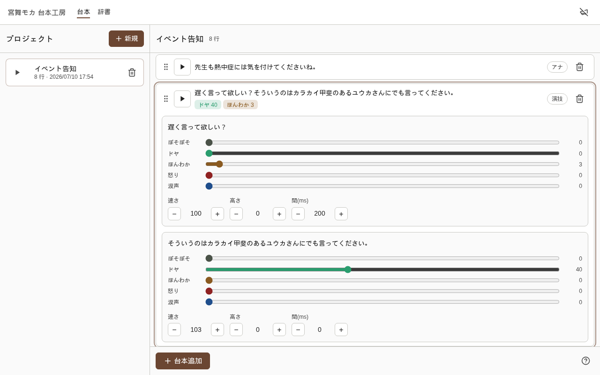

# moca-server

VOICEPEAK (宮舞モカ) の音声合成を HTTP でストリーミング配信する家庭内サーバー。
LLM による感情パラメータの自動生成に対応。文単位で逐次合成するため、
1文目ができた時点（約1.2秒）で再生が始まる。



## セットアップ

必要なもの: VOICEPEAK と `moca-server` バイナリ。感情分析を使うなら LLM backend
(`claude` CLI または OpenAI 互換 API) も ([設定の詳細](./docs/config.md))。

**リリースバイナリを使う** — [GitHub Releases](https://github.com/miyabisun/moca-server/releases)
から `moca-server` バイナリと SPA 成果物 `client-build.tar.gz` を取得 (`.sha256` で整合性確認)。
SPA 成果物は実行ディレクトリの `client/build` に展開してから起動する。

**ソースからビルド** — Rust toolchain と [Bun](https://bun.sh) だけで足りる
(Opus は純 Rust 実装の [ropus](https://crates.io/crates/ropus) を使うため C ライブラリ不要):

```sh
git clone https://github.com/miyabisun/moca-server.git
cd moca-server
cp .env.example .env        # PORT / DATABASE_PATH / VOICEPEAK などを調整
(cd client && bun install && bun run build)
cargo build --release
./target/release/moca-server
```

## 使い方

ブラウザで `http://localhost:3000/` を開くと管理画面 (台本工房)。
台本の作成・感情の微調整・再生ができ、[vim 風のキーボード操作](./docs/shortcuts.md)に対応する
(アプリ内の `?` キーでも一覧表示)。

CLI クライアント (`bash` / `curl` / `ffplay` があれば動く):

```sh
curl -o ~/bin/moca https://raw.githubusercontent.com/miyabisun/moca-server/main/bin/moca
chmod +x ~/bin/moca
export MOCA_URL=http://<server-host>:3000

# 感情分析つきで再生。台本JSONが stdout に表示される
moca "やった、ついに完成した！でも、ちょっと疲れたかも。"

# 感情分析なしでそのまま読み上げ (低レイテンシ。朗読・通知向け)
moca -r "ビルドが完了しました"
```

通知購読 (`bin/moca-notify`): 管理画面のメガホンを ON にしておくと、
`moca-notify "テキスト"` で送った通知をブラウザ側で宮舞モカが読み上げる。
tmux のベルと繋ぐと「ssh 先の完了通知を手元で聞く」ができる:

```tmux
set-hook -g alert-bell 'run-shell "moca-notify \"#{session_name} が待ってます\""'
```

ブラウザを開かず常駐購読する場合は `moca-listen` を使う。切断時は自動再接続し、
`ffplay` があれば Ogg/Opus、なければ macOS / Linux / WSL の標準系プレイヤーで WAV を再生する。

## ドキュメント

- [アーキテクチャと設計方針](./docs/architecture.md)
- [CLI クライアントの詳しい使い方](./docs/cli.md)
- [API リファレンス (台本JSONスキーマ・制限)](./docs/api.md)
- [設定 (環境変数・感情分析 backend・カタカナ辞書)](./docs/config.md)
- [キーボードショートカット](./docs/shortcuts.md)
- [常駐化 (systemd)・自動更新](./docs/deploy.md)
- [テスト (cargo test / Playwright E2E)](./docs/testing.md)

## 注意

認証なしの家庭内 LAN 専用。インターネットに公開しないこと。

## ライセンス

本リポジトリのコード (moca-server 本体) は [MIT ライセンス](./LICENSE) の下で配布する。

ただし本リポジトリは音声合成エンジン **VOICEPEAK 本体および音源データを一切含まない**。VOICEPEAK / 宮舞モカ (およびその他の音源) は AH-Software 株式会社の商用製品であり、その利用条件は同社のライセンスに従うこと。moca-server 側の MIT ライセンスは VOICEPEAK 本体には及ばない。
